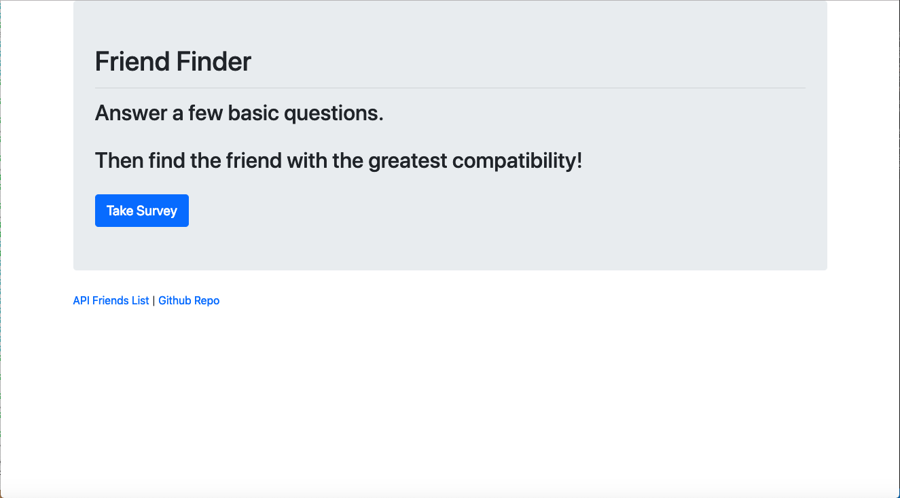
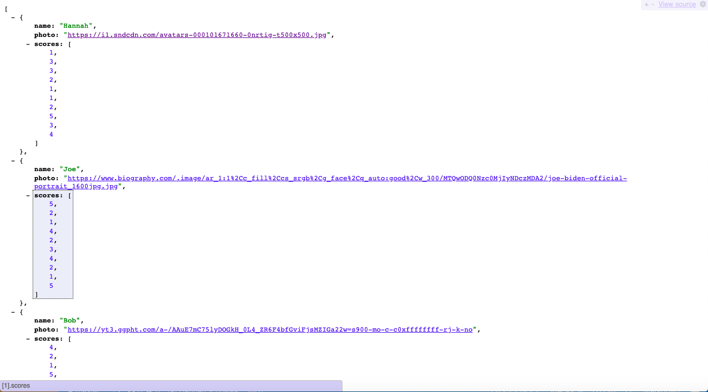
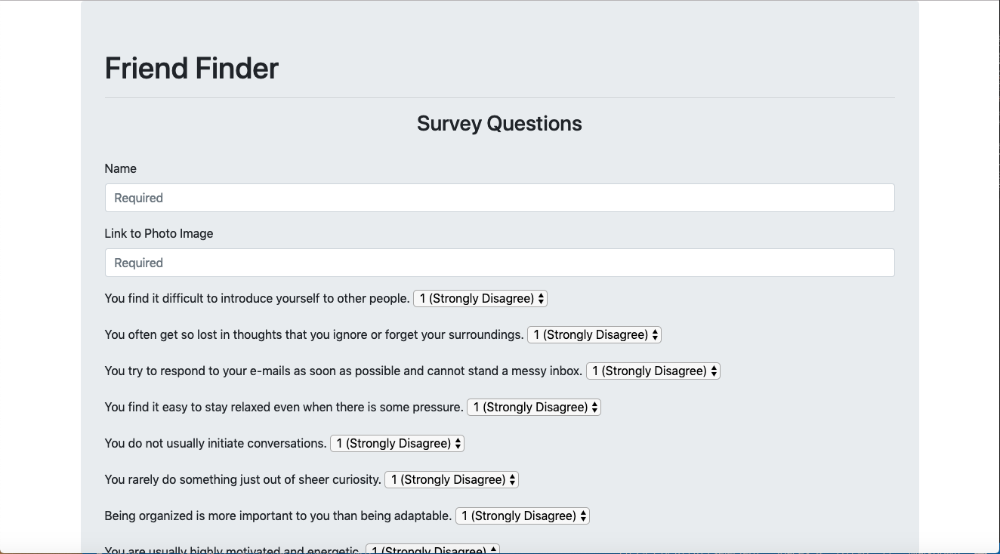
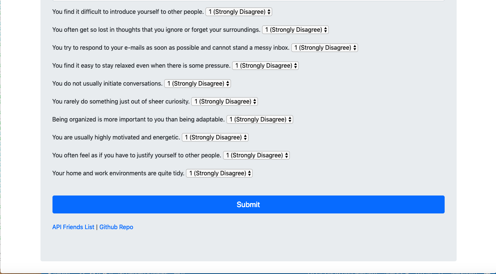
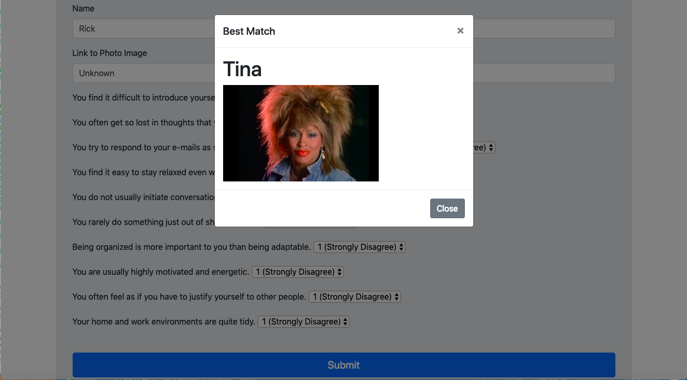
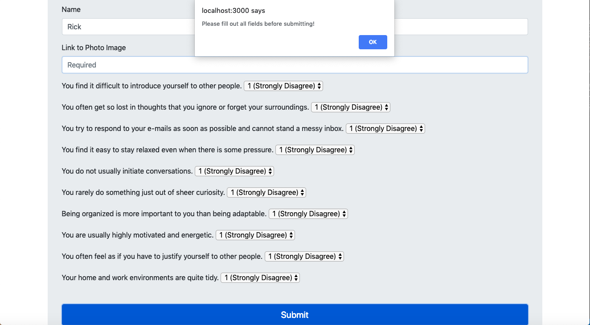
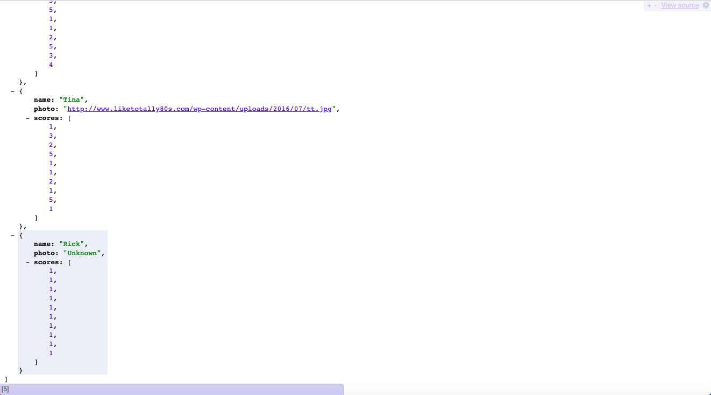

# FriendFinder

This is an compatibility-based "FriendFinder" application -- basically a dating app, but for friends. This full-stack site will take in results from the users' surveys and compare their answers with those from other users, the creator, or other 'imaginary friend' placeholders. The app will thereafter display the name and photo of the user with the best overall match.

A project requiring Javascript/JQuery/NodeJS/Express, this is assignment 10 of UMN's Coding Bootcamp. 

### Prerequisites

To utilize this project, access my files via my FriendFinder Github repository at https://github.com/HannahSchuelke/FriendFinder and/or my Heroku link at https://young-shelf-22385.herokuapp.com/. If you choose to download my files, you must save them to one root folder on your computer. From the same folder you must do NPM installs, and for path and express as well. After you follow these steps, the server should start by entering in your terminal `node server.js`. After you have completed these steps, you should be able to access my site by entering http://localhost:3000/ into your browser.

### Installing

1. Direct yourself to the folder where you'd like to test my project and download the files from my github at https://github.com/HannahSchuelke/FriendFinder into it. 
2. Do npm installs inside the same root folder from your terminal command line: `npm install` `npm install express` `npm install path`. 
3. Make a .gitignore file and type `node_modules`, `.DS_Store`, and `.env` into it. 
4. Download MAMP at https://www.mamp.info/en/downloads/. After completed the app will open, and click to start the server.  
5.  Open up your terminal and direct yourself to the folder where you have rooted my project. Enter `node server.js`.
6.  From here you may access my store by entering http://localhost:3000/ into your browser.
7.  Click the button to take a survey, and find your friends from there!

### How to use

After following the steps above, your browser will first populate with the home directory. Click the button `Take Survey` and it will redirect you to the survey page. 

You may also click `API Friends List` here to see potential matches. `Github Repo` at the bottom will take you to my FriendFinder repo.

After clicking `Take Survey`, your webpage will transition to the survey page as seen below. 

After you've completed your survey, click `submit` and your match will populate your screen. 

If you do not fill in all required fields, the request cannot be processed and you will be prompted to fill out the form completely. 

After you've gotton your match, you can see that your list of potential matches increased by clicking the `API Friends List` at the bottom of the page. If you take the survey again, your new entry will be added to the bottom of the list.

### Github repository

https://github.com/HannahSchuelke/FriendFinder

### Deployed Github link

https://hannahschuelke.github.io/FriendFinder/

### Deployed Heroku link

https://young-shelf-22385.herokuapp.com/

### Built With

* [npm install](https://docs.npmjs.com/cli/install) - Installs package.json and node.modules that app depends on
* [express](https://expressjs.com/en/starter/installing.html) - Needed for sending and recieving server requests
* [path](https://docs.npmjs.com/cli/install) - Needed to set up API/HTML routes
* [MAMP](https://www.mamp.info/en/downloads/) - Needed to operate MySQL Workbench

### Authors

* **Hannah Schuelke** - (https://github.com/HannahSchuelke)